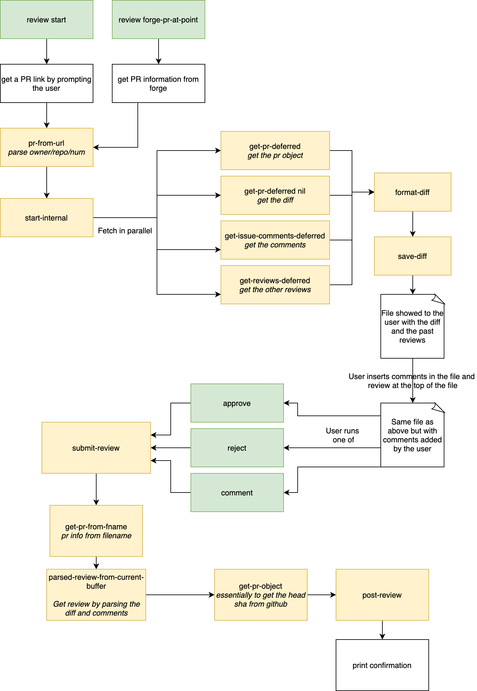

[](https://melpa.org/#/github-review)

# github-review: GitHub code reviews with Emacs.

This package contains a handful of Emacs commands to review GitHub pull request
without leaving Emacs.

To get an overview of the package you can watch this 4-minute video:

[](https://www.youtube.com/watch?v=u2tKzmKTNy4)

You can start by calling `github-review-start` and entering a Pull Request URL. You will, then be prompted with a buffer containing the diff of the pull request. The diff contains the description of the PR at the top with line starting with `~`. For example, reviewing [this pull request](https://github.com/clojure/clojurescript-site/pull/293) would open the following buffer:

```diff
~ Fix broken link to closure cheat sheet
~
~ The owner of http://www.closurecheatsheet.com/ lost the domain and does not intend to maintain it. This commit replaces the now defunkt link to http://www.closurecheat$
~ ^M
~ I also opened an issue on the cheat sheet repo to follow up with the author of the cheat sheet https://github.com/kuzmisin/closurecheatsheet/issues/12.
diff --git a/content/reference/google-closure-library.adoc b/content/reference/google-closure-library.adoc
index 58baa4b..eae7707 100644
--- a/content/reference/google-closure-library.adoc
+++ b/content/reference/google-closure-library.adoc
@@ -18,7 +18,7 @@ rich-text editing, and UI widgets/controls.

 * http://google.github.io/closure-library/api/[Google Closure Library
 API Reference]
-* http://www.closurecheatsheet.com/[Closure Cheatsheet] - abridged API
+* https://github.com/kuzmisin/closurecheatsheet[Closure Cheatsheet] - abridged API
 with usage examples

 [[try-the-wrapper-libraries-first]]
```

You can add comments at the top-level by writing lines starting with `#` after the PR description and before the beginning of the diff.

You can add comments inline by adding lines starting with `#` inline. See these features in the example below:

```diff
~ Fix broken link to closure cheat sheet
~
~ The owner of http://www.closurecheatsheet.com/ lost the domain and does not intend to maintain it. This commit replaces the now defunkt link to http://www.closurecheat$
~ ^M
~ I also opened an issue on the cheat sheet repo to follow up with the author of
the cheat sheet https://github.com/kuzmisin/closurecheatsheet/issues/12.
# This is a global comment at the top of the file
# with multiple
# lines and will be submitted as a top level review comment
diff --git a/content/reference/google-closure-library.adoc b/content/reference/google-closure-library.adoc
index 58baa4b..eae7707 100644
--- a/content/reference/google-closure-library.adoc
+++ b/content/reference/google-closure-library.adoc
@@ -18,7 +18,7 @@ rich-text editing, and UI widgets/controls.

 * http://google.github.io/closure-library/api/[Google Closure Library
 API Reference]
-* http://www.closurecheatsheet.com/[Closure Cheatsheet] - abridged API
+* https://github.com/kuzmisin/closurecheatsheet[Closure Cheatsheet] - abridged API
# And a comment inline about
# a specific line
# ```with some
# code```
  with usage examples
# Some other comment inline
 with usage examples

 [[try-the-wrapper-libraries-first]]
```

Once done, you can submit your review with one of `github-review-approve`, `github-review-comment`, and `github-review-reject`.

## Usage with Forge

You can use `github-review` with `forge`(https://github.com/magit/forge).
When your cursor is over a pull request, you can call `github-review-forge-pr-at-point` to start a code
review.

## Installation

### With melpa

This is the preferred way of installing this package.

### With doom emacs

`github-review` gets installed automatically if you are using the `magit` module.

If you just want to install `github-review` separately, add the following to your config:

```emacs-lisp
(package!
 github-review
 :recipe
    (:host github
     :repo "charignon/github-review"
     :files ("github-review.el")))
```

## Configuration

`github-review` needs a GitHub token to act on your behalf for fetching PRs and
submitting reviews.

Create a personal access token using GitHub (https://github.com/settings/tokens) and add a line to your auth source files with your login and token:

```
machine api.github.com login yourlogin^github-review password MYTOKENGOESHERE
```

## Customization

If you use GitHub Enterprise, you can use the `github-review-host` custom variable to
configure the endpoint of your GitHub Enterprise installation.

By default, `github-review` fetches all comments in a pull request. You can set `github-review-fetch-top-level-and-review-comments` to `nil` switch to only fetching the PR title summary and diff.

## Code structure

In yellow: internal functions

In green: entrypoints




Source for the diagram is in github-review.draw.io
